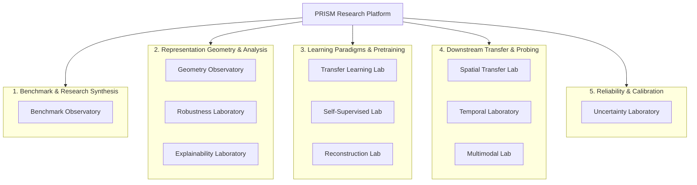
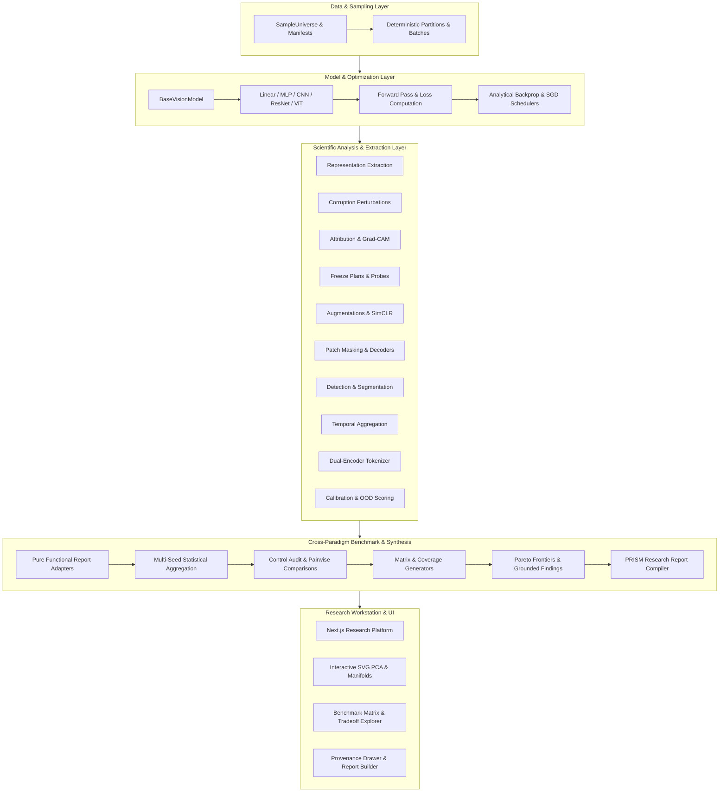

# PRISM — Probing the Evolution of Visual Representations

**A reproducible computer vision research platform for studying how visual representations evolve across architectures, learning objectives, distribution shifts, and downstream tasks.**

PRISM evaluates representation learners not solely on top-line classification accuracy, but across internal geometry, downstream transferability, corruption robustness, visual attribution, temporal consistency, multimodal vision-language alignment, calibration, and failure dynamics.

```
       ┌────────────────────────────────────────────────────────┐
       │                         PRISM                          │
       │    Probing the Evolution of Visual Representations     │
       └────────────────────────────────────────────────────────┘
                                    │
     ┌──────────────────────────────┼──────────────────────────────┐
     ▼                              ▼                              ▼
Linear & Shallow           Deep Convolutions &              Transformers &
Baselines                  Residual Learning                Self-Supervision
(Softmax, Linear)          (MLP, CNN, ResNet, Schedulers)   (ViT, Self-Attn, SSL)
```

---

## Why PRISM Exists

Traditional deep learning evaluation predominantly focuses on scalar test set accuracy. However, models achieving identical accuracy often exhibit radically divergent internal feature geometry, susceptibility to distribution shifts, transferability to dense downstream tasks, and calibration profiles.

**PRISM focuses on controlled representation research rather than state-of-the-art benchmark chasing.** It provides a disciplined, fully deterministic, CPU-executable experimental harness where every representation can be inspected, compared, probed, and synthesized across standard architectural and objective axes.

---

## What PRISM Studies

```mermaid
graph LR
    subgraph Architectures
        A1[Linear / Shallow]
        A2[Multi-Layer Perceptron]
        A3[Deep CNN]
        A4[ResNet with Skips]
        A5[Vision Transformer]
    end

    subgraph Objectives
        O1[Supervised Cross-Entropy]
        O2[SimCLR Contrastive SSL]
        O3[Masked Autoencoding]
        O4[Dual-Encoder Vision-Language]
    end

    subgraph Probes
        P1[Manifold Geometry & PCA]
        P2[Corruption Drift & Stability]
        P3[Visual Attribution & Saliency]
        P4[Linear / Fine-Tuning Transfer]
        P5[Detection & Segmentation]
        P6[Video & Temporal Consistency]
        P7[Multimodal Retrieval & Zero-Shot]
        P8[Uncertainty & OOD Detection]
    end

    subgraph Synthesis
        S1[Benchmark Matrix & Pareto Frontiers]
        S2[Evidence-Grounded Research Reports]
    end

    Architectures --> Probes
    Objectives --> Probes
    Probes --> Synthesis
```



---

## Research Domain Map & Laboratories

PRISM organizes 11 specialized laboratories across 5 research domains:



### 1. Benchmark & Evidence Synthesis
- **Benchmark Observatory**: Top-level research workspace orchestrating cross-paradigm evaluation campaigns, computing multi-dimensional representation profiles, identifying Pareto-optimal tradeoffs, tracking evidence coverage gaps, and generating publication-ready Markdown/JSON/CSV research reports.

### 2. Representation Geometry & Analysis
- **Geometry Observatory**: In-memory $k$-NN neighborhood consistency, class centroid dispersion, separation-to-compactness ratios $\mathcal{S}/\mathcal{C}$, exact Jacobi PCA projections, and layer-by-layer manifold evolution.
- **Robustness Laboratory**: 6 corruption families (`gaussian_noise`, `blur`, `brightness`, `contrast`, `occlusion`, `resolution_degradation`) across 5 severity levels, measuring shared PCA displacement vectors and attention entropy degradation.
- **Explainability Laboratory**: Input gradient saliency, Gradient $\times$ Input, sliding-window occlusion sensitivity, Grad-CAM, ViT CLS attention rollout, and cross-method attribution agreement.

### 3. Learning Paradigms & Pretraining
- **Transfer Learning Laboratory**: Four transfer strategies (`SCRATCH_BASELINE`, `LINEAR_PROBE`, `PARTIAL_FINE_TUNE`, `FULL_FINE_TUNE`), layer-wise linear probing, parameter freeze plans, and sample-efficiency scaling curves.
- **Self-Supervised Learning Laboratory**: Contrastive pretraining (SimCLR) with deterministic augmentations, 2-layer MLP projection heads, NT-Xent loss, and dimensional collapse diagnostics.
- **Reconstruction Laboratory**: Masked autoencoding with deterministic SHA-256 patch masking, learnable mask tokens, spatial/patch reconstruction decoders, and masked MSE optimization.

### 4. Downstream Transfer & Probing
- **Spatial Transfer Laboratory**: Bounding box object detection (`GridDetectionHead`) and dense pixel semantic segmentation (`SegmentationHead`) evaluating spatial feature map reuse from CNN, ResNet, and ViT backbones.
- **Temporal Laboratory**: Multi-frame video representation sequences, temporal pooling aggregators (`Mean`, `Max`, `Last`, `Learned`, `SimpleRNN`), motion velocity correlation, and temporal perturbation robustness.
- **Multimodal Laboratory**: Dual-encoder vision-language alignment, deterministic tokenization, symmetric InfoNCE contrastive loss, bidirectional text/image retrieval (R@1/3/5, MRR), and zero-shot classification.

### 5. Reliability & Calibration
- **Uncertainty Laboratory**: Shift-invariant predictive entropy, Expected Calibration Error (ECE), post-hoc temperature scaling optimization, out-of-distribution (OOD) scoring (MSP, entropy, centroid distance, $k$-NN distance, Free Energy), exact Mann-Whitney AUROC, and uncertainty failure taxonomy.

---

## System Architecture



---

## Quick Start

### Prerequisites
- Python 3.10+ (Python 3.11 recommended)
- [uv](https://github.com/astral-sh/uv) (recommended) or standard `pip`
- Node.js 18+ & npm (for research observatory UI)

### 1. One-Command Setup
```bash
# Clone the repository
git clone https://github.com/mzayan-bit/prism-visual-representations.git
cd prism-visual-representations

# Set up Python virtual environment and frontend dependencies
make setup
```

### 2. Generate the Official Demonstration Campaign
```bash
# Generates deterministic showcase campaign, benchmark matrices, and research reports
make demo
```

### 3. Launch the Research Workstation
```bash
# Starts the Next.js research observatory on http://localhost:3000
make dev
```

### 4. Run the Complete Verification Suite
```bash
# Executes formatting, linting, type-checking, pytest, and frontend builds
make check
```

---

## Official Demonstration Campaign

PRISM includes an official deterministic demonstration campaign: **PRISM Representation Showcase**.

- **Artifacts Location**: `artifacts/demo/`
- **Showcase Matrix**: 810 observed evaluation cells spanning 3 architectures (`CNN`, `ResNet`, `ViT`), 5 pretraining objectives (`Supervised`, `SimCLR`, `Reconstruction`, `Vision-Language`, `Scratch`), and 3 fixed random seeds (`42`, `100`, `2024`).
- **Generation Script**: `scripts/generate_demo.py` (`--check`, `--dry-run`, `--seed`, `--output-dir`).
- **Generated Reports**:
  - `artifacts/demo/prism_demo_report.md` (Formal Markdown synthesis with reproducibility manifest)
  - `artifacts/demo/prism_demo_report.json` (Structured JSON benchmark summary)
  - `artifacts/demo/benchmark_matrix.csv` (Pivot table across metrics and models)
  - `artifacts/demo/benchmark_table.csv` (Raw canonical evaluation records)

To learn more about the demo structure, see the [Demo Guide](docs/demo/README.md).

---

## Testing & Reproducibility

PRISM is built with rigorous reproducibility standards:
- **Zero Global RNG Mutation**: All random sequences (masking, augmentations, initializations, dataset splits) are derived deterministically from explicit seeds and SHA-256 hashes.
- **Strict Numerical Safeguards**: Shift-invariant softmax, log-sum-exp normalization, bounded variance epsilon, and zero-norm protections across all metric computations.
- **Zero Secret or Machine-Specific Dependencies**: 100% self-contained, CPU-executable with pure-Python reference backends.

```bash
# Run release smoke tests
uv run pytest tests/smoke/test_smoke_release.py

# Run full test suite (657 tests)
uv run pytest
```

| Quality Gate | Tool | Status |
| :--- | :--- | :--- |
| Code Formatting | Ruff | :white_check_mark: Passing (447 files) |
| Static Linting | Ruff (E, W, F, I, N, UP, B, C4, SIM, RUF) | :white_check_mark: Passing (0 errors) |
| Strict Static Typing | Mypy (strict mode) | :white_check_mark: Passing (394 modules) |
| Backend Test Suite | Pytest (Unit & Smoke) | :white_check_mark: 657 / 657 Passing |
| Frontend Type-Checking | TypeScript 5.0 | :white_check_mark: 0 errors |
| Frontend Static Build | Next.js 16.3.2 Turbopack | :white_check_mark: Prerendered |

---

## Example Research Questions Investigated

1. **Geometry**: How does intra-class compactness versus inter-class separation evolve as representation depth increases in CNNs vs Vision Transformers?
2. **Robustness**: Does contrastive self-supervised pretraining produce more stable representations under high-frequency noise corruptions compared to supervised learning?
3. **Attribution**: How well do gradient-based saliency maps and transformer attention rollout agree on localized object features under distribution shifts?
4. **Transferability**: In low-data regimes (10% target labels), does linear probing outperform full fine-tuning for representations pretrained with reconstruction objectives?
5. **Spatial Downstream**: How effectively do spatial patch tokens from masked autoencoders preserve spatial coordinate locality when transferred to bounding box detection?
6. **Temporal Consistency**: Do shared frame encoders trained with static supervised losses maintain smooth trajectory representations across continuous video motion?
7. **Multimodal Alignment**: How severe is visual representation drift when aligning vision and text encoders under symmetric contrastive objectives?
8. **Uncertainty & Calibration**: What is the empirical correlation between class centroid distance in representation space and predictive confidence under out-of-distribution shifts?

---

## Project Status

- **Core Research Platform**: :white_check_mark: Complete (`v1.0.0`)
- **Public Research Release**: :white_check_mark: Complete
- **Future Research Directions**: Optional follow-up explorations (e.g., scaling to larger real-world datasets, multi-GPU training backends, and additional self-supervised architectures).

---

## Limitations

PRISM is designed as a controlled scientific research platform and educational testbed, not a production deep learning framework:
- **Compute Regime**: Uses CPU-optimized pure-Python tensor routines designed for deterministic verification, reproducibility, and exact mathematical clarity rather than distributed GPU scale.
- **Controlled Scale**: Evaluates micro-benchmarks and controlled synthetic datasets to isolate representation phenomena without confounding web-scale dataset biases.
- **Reference Implementations**: Prioritizes explicit, inspectable backpropagation and state transitions over black-box library wrappers.

---

## Repository Structure

```
prism-visual-representations/
├── backend/                   # Python research engine
│   ├── src/prism/             # Core research library
│   │   ├── api/               # Research service layer & demo data serving
│   │   ├── artifacts/         # Artifact contracts and references
│   │   ├── benchmarking/      # Benchmark orchestration, synthesis & reporting
│   │   ├── core/              # System primitives, enums, errors, metadata
│   │   ├── data/              # Datasets, manifests, partitions & batching
│   │   ├── evaluation/        # Evaluation engine & metric specifications
│   │   ├── experiments/       # Experiment contracts, execution harness & audits
│   │   ├── explainability/    # Attribution, saliency, Grad-CAM & rollout
│   │   ├── models/            # Linear, MLP, CNN, ResNet, ViT architectures
│   │   ├── multimodal/        # Vision-language alignment & dual encoders
│   │   ├── reconstruction/    # Masked autoencoding & spatial decoders
│   │   ├── representations/   # Geometry, PCA, centroids & neighborhoods
│   │   ├── robustness/        # Corruptions, drift analysis & OOD suites
│   │   ├── spatial/           # Bounding box detection & segmentation transfer
│   │   ├── ssl/               # Self-supervised contrastive learning (SimCLR)
│   │   ├── temporal/          # Video representations & temporal pooling
│   │   ├── training/          # Training engine, losses, optimizers & schedulers
│   │   ├── uncertainty/       # Calibration, temperature scaling & OOD scoring
│   │   └── utils/             # Seeding, cryptographic hashing, logging
│   └── tests/                 # Backend unit, smoke, and integration test suites
│
├── frontend/                  # Next.js / TypeScript research observatory
│   ├── app/                   # App router, domain navigation & pages
│   │   ├── components/        # Laboratory views, charts, cards & drawers
│   │   └── page.tsx           # Observatory workstation shell
│   └── public/                # Static assets and schemas
│
├── artifacts/                 # Versioned research outputs & showcase campaign
│   └── demo/                  # Deterministic demo campaign & reports
├── configs/                   # Declarative YAML experiment configs
├── docs/                      # Technical documentation & methodology guides
│   ├── architecture/          # System topology & domain blueprints
│   ├── benchmarking/          # Benchmark guides & metric definitions
│   ├── demo/                  # Official demonstration guide
│   ├── development/           # Developer setup & repository conventions
│   └── methodology/           # Research contracts & fairness protocols
├── scripts/                   # CLI utilities & demo generation script
├── tests/                     # Top-level smoke, unit, and release tests
├── CHANGELOG.md               # Versioned release notes
├── Makefile                   # One-command developer workflows
└── pyproject.toml             # Package specification & tool configuration
```

---

## Documentation

- [Documentation Index](docs/README.md)
- [Architecture Overview](docs/architecture/overview.md)
- [Demonstration Campaign Guide](docs/demo/README.md)
- [Research Contract & Methodology](docs/methodology/research-contract.md)
- [Developer Setup & Getting Started](docs/development/getting-started.md)
- [Repository Conventions](docs/development/repository-conventions.md)
- [Cross-Paradigm Benchmarking](docs/benchmarking/README.md)
- [Release Notes](CHANGELOG.md)

---

## License

This project is licensed under the terms of the [MIT License](pyproject.toml).
