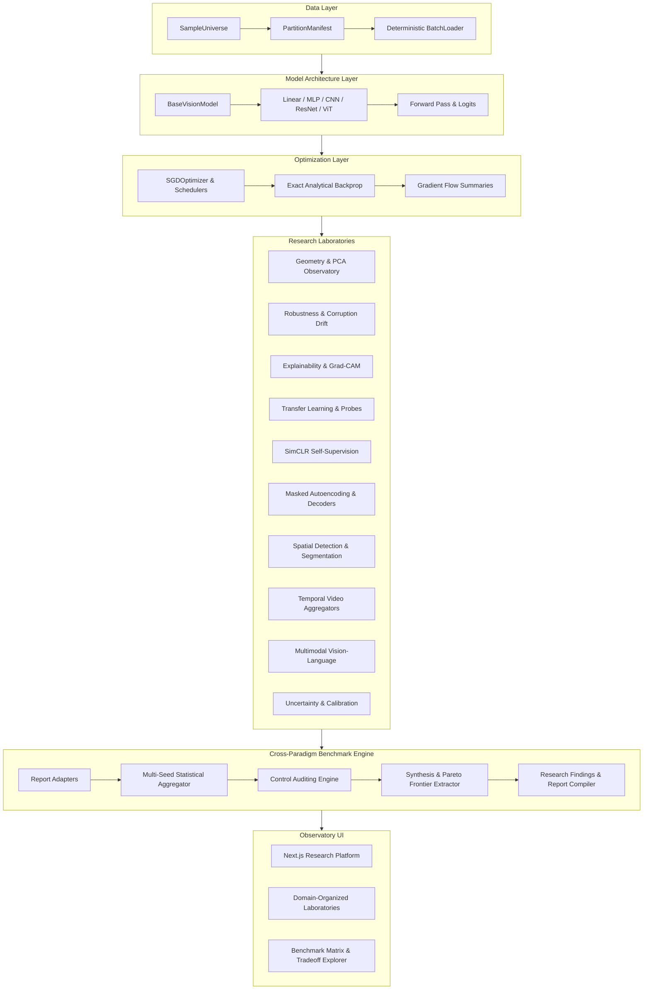

# PRISM Architecture Overview

## Research Lifecycle

```mermaid
flowchart LR
    A[Dataset Universe & Fixed Manifest] --> B[Experiment Definition & Audit]
    B --> C[Controlled Model Execution & Training]
    C --> D[Representation & Diagnostic Extraction]
    D --> E[Domain Laboratory Analysis & Report]
    E --> F[Pure Functional Benchmark Adapter]
    F --> G[Cross-Paradigm Evidence Synthesis]
    G --> H[Pareto Tradeoffs & Research Report]
    H --> I[Interactive Observatory & Export]
```



## System Topology



## Controlled Architecture Experiment Layer

`ArchitectureComparisonSuite` composes existing experiment, data, training,
evaluation, model, and representation contracts. It records the research
question, definitions, comparison mode, data identity, policies, and
lifecycle; it does not implement model mathematics or a second training loop.

`STRICT_CONTROLLED` audits typed dataset, partition/subset, preprocessing,
seed, model, optimizer, scheduler, training, and evaluation factors and
rejects undeclared differences. `ARCHITECTURE_APPROPRIATE` permits declared
architecture-specific settings while retaining those differences in the
audit and report. `ExperimentSuiteRunner` returns compact metric, curve,
convergence, gradient, representation, attention, and pairwise summaries.

## Monorepo Layout & System Design

PRISM is architected as a modular research monorepo structured around clean domain boundaries.

```
prism-visual-representations/
├── backend/                   # Python research engine and package
│   ├── src/
│   │   └── prism/             # Core library package
│   │       ├── api/           # Future API serving layer
│   │       ├── artifacts/     # Artifact contracts and references
│   │       ├── core/          # Base enums, identifiers, errors, metadata
│   │       ├── data/          # Samples, universes, materialization, ordering, batching
│   │       ├── experiments/   # Definitions, runs, harness, seeding, comparisons
│   │       ├── models/        # Linear, MLP, CNN, ResNet, residual blocks, conv2d, pooling, norm
│   │       ├── training/      # Training engine, losses, SGD, schedulers, gradient flow
│   │       ├── evaluation/    # Evaluation engine, metrics, and structured reports
│   │       ├── representations/# Representation descriptors, feature batches, summaries
│   │       ├── robustness/    # Corruptions, distribution shifts, OOD tests
│   │       ├── explainability/# Saliency, attention rollout, Grad-CAM
│   │       ├── visualization/ # Projections (UMAP/t-SNE), figure generation
│   │       └── utils/         # Seeding, hashing, structured logging
│   └── tests/                 # Backend unit, smoke, and integration test suites
│
├── frontend/                  # Next.js / TypeScript research observatory
│   ├── app/                   # App Router pages and layout
│   └── ...
│
├── configs/                   # Declarative YAML configurations
│   ├── base/                  # Runtime and environment defaults
│   ├── datasets/              # Dataset and preprocessing configs
│   ├── experiments/           # End-to-end experiment definitions
│   ├── models/                # Architecture configurations
│   └── training/              # Optimization schedules and budgets
│
├── experiments/               # Research artifacts and analyses
│   ├── notebooks/             # Exploratory Jupyter notebooks
│   └── reports/               # Synthesized research findings
│
├── docs/                      # Technical and methodology documentation
│   ├── architecture/          # Architecture blueprints
│   ├── methodology/           # Research contracts and fairness standards
│   ├── experiments/           # Campaign notes
│   └── development/           # Setup and developer guides
│
├── data/                      # Local data stores (git-ignored raw data)
├── artifacts/                 # Generated run outputs (checkpoints, metrics, figures)
└── tests/                     # Top-level smoke, unit, and integration test suites
```

---

## Trainable Baseline & Deep Learning Architecture

PRISM supports linear classifiers, deep MLPs, Convolutional Neural Networks (CNNs), and Deep Residual Neural Networks (ResNets) with explicit skip connections, dual-branch gradient propagation, deterministic pooling, batch normalization, regularization, and learning-rate scheduling:

```
ExperimentDefinition (Linear / MLP / CNN / ResNet Specification)
        │
        ▼
Runtime Preparation (ExperimentExecutionHarness.prepare)
        │
        ▼
Materialized Dataset & Deterministic Batches (DataPreparer)
        │
        ▼
Model Execution (ResidualNeuralNetwork / ConvolutionalNeuralNetwork)
        │
        ├── 1. Stem Processing: Conv2D -> BatchNorm2D -> Activation [N, C_stem, H, W]
        ├── 2. Residual Stages: Stacks of composable ResidualBlock instances
        │      • Main Path F(x): Conv2D -> BatchNorm2D -> Act -> Conv2D -> BatchNorm2D
        │      • Shortcut Path S(x): Identity (S(x)=x) or Projection (Conv2D 1x1 + BatchNorm2D)
        │      • Explicit Residual Addition: Z = F(x) + S(x) (strict shape validation)
        │      • Post-Addition Non-Linearity: Y = Activation(Z)
        ├── 3. Feature Maps: "stem", "stage_s_block_b_residual", "stage_s_block_b_shortcut", "stage_s_block_b_post_add"
        ├── 4. Flatten to Vector: [N, D_spatial] where D_spatial = C_last * H_last * W_last
        └── 5. Classifier Head & Raw Logits: Z = H @ W_cls + b_cls [N, num_classes]
        │
        ▼
SoftmaxCrossEntropyLoss (Numerically Stabilized)
        │
        ├── 6. Loss = - (1/B) * sum(log(P_yi))
        └── 7. Analytic Gradient: dZ = (P - 1(y==c)) / B
        │
        ▼
Backward Pass & Optimization (SGDOptimizer + Scheduler)
        │
        ├── 8. Classifier backprop -> dH_spatial [N, D_spatial]
        ├── 9. Spatial unflatten -> dY_final_spatial [N, C_last, H_last, W_last]
        ├── 10. Residual Addition Backprop: routes upstream dZ to BOTH branches (dF = dZ, dS = dZ)
        │       • Summed Input Gradient: dX = dX_main + dX_shortcut
        │       • Accumulates parameter gradients in conv1, conv2, norm1, norm2, and proj_conv
        ├── 11. Scheduler Steps LR: lr(epoch) via Step or Cosine Annealing
        └── 12. Optimizer Step: updates trainable parameters (W, b, gamma, beta) only
        │
        ▼
Gradient Flow Tracking & Evaluation Engine
        │
        ├── 13. ParameterGradientSummary & ModelGradientFlowSummary across depth
        ├── 14. MetricRecords logged into ExperimentRun (loss, acc, lr, grad_norm)
        └── 15. EvaluationReport on Test Partition (Eval mode, dropout disabled, running stats used)
        │
        ▼
TrainingResult & Completed Run Lifecycle
```

### 1. Residual Learning & Skip Connections (`prism.models.residual`)
- `ResidualAdd`: Explicit tensor addition node validating compatible dimensions $[N, C, H, W]$. Upstream gradient routes identically to both branches ($dA = dZ, dB = dZ$).
- `IdentityShortcut`: Parameter-free skip connection for shape-preserving residual blocks ($S(x) = x$).
- `ProjectionShortcut`: $1\times 1$ convolution with optional `BatchNorm2D` for spatial downsampling and channel expansion ($S(x) = \text{Norm}(\text{Conv2D}(x, 1\times 1, \text{stride}=s))$).
- `ResidualBlock`: Composable 2-convolution residual block ($y = \text{act}(F(x) + S(x))$) with exact analytical backpropagation through both branches.

### 2. `ResidualNeuralNetwork` (`prism.models.resnet`)
- Multi-stage residual vision model composed of stem, configurable stages and blocks per stage, spatial flattening/pooling, and classifier heads.
- Exposes intermediate representations: `"stem"`, `"stage_{s}_block_{b}_residual"`, `"stage_{s}_block_{b}_shortcut"`, `"stage_{s}_block_{b}_post_add"`, `"stage_{s}_block_{b}"`, `"final_spatial"`, `"final_hidden"`, `"logits"`.

### 3. Gradient Flow Research Infrastructure (`prism.training.gradient_flow`)
- `ParameterGradientSummary`: Captures layer identifier, logical stage, relative depth index, L2 norm, mean, std dev, min, max, zero fraction, finiteness status, and tensor dimensions.
- `ModelGradientFlowSummary`: Structured container tracking depth-ordered parameter gradient summaries and global gradient norms.
- `compute_gradient_flow_summary`: Non-mutating gradient extractor scanning model parameters and gradients.
- `compare_gradient_flow_summaries`: Measures global norm ratios, norm deltas, early-to-late gradient ratios, and layer-by-layer gradient shifts.

### 4. `BatchNorm1D` & `BatchNorm2D` (`prism.models.normalization`)
- `BatchNorm1D`: Normalizes vector representations $[N, D]$ feature-wise.
- `BatchNorm2D`: Normalizes convolutional representations $[N, C, H, W]$ channel-wise across all $N \times H \times W$ spatial and batch positions.
- **Train vs Eval Mode Semantics**:
  - In training mode: computes current batch mean $\mu_B$ and variance $\sigma_B^2$, normalizes batch, updates non-trainable running statistics ($\text{running\_mean}$, $\text{running\_var}$) via exponential moving average with configurable `momentum`.
  - In evaluation mode: strictly freezes running statistics and normalizes inputs using stored running mean and variance.
- **Trainable Parameters vs State**:
  - Trainable parameters: affine scale $\gamma$ (init $1.0$) and shift $\beta$ (init $0.0$) updated by `SGDOptimizer`.
  - Non-trainable state: `running_mean` and `running_var` discovered via `get_state()` and never updated by optimizers.

### 5. `Conv2D` & Pooling (`prism.models.convolution`, `prism.models.pooling`)
- `Conv2D`: Multi-channel 2D convolution layer operating on $[N, C_{\text{in}}, H_{\text{in}}, W_{\text{in}}]$ tensors with full analytical backpropagation.
- `MaxPool2D` & `AvgPool2D`: Spatial pooling with exact argmax index tracking or uniform gradient routing.

### 6. Learning Rate Scheduling & Optimization Control (`prism.training.schedulers`)
- `BaseLRScheduler`: Abstract base contract defining deterministic stepping, progress tracking (`current_step`, `current_epoch`, `history`), and full state restoration.
- `ConstantLRScheduler`: Baseline schedule emitting invariant $\text{lr}(t) = \text{initial\_lr}$.
- `StepLRScheduler`: Multi-step discrete decay: $\text{lr}(t) = \max(\text{min\_lr}, \text{initial\_lr} \cdot \gamma^k)$ where $k = t // \text{step\_size}$.
- `ExponentialLRScheduler`: Continuous exponential decay: $\text{lr}(t) = \max(\text{min\_lr}, \text{initial\_lr} \cdot \gamma^{t / \text{decay\_steps}})$.
- `CosineAnnealingLRScheduler`: Cosine annealing decay bounded in $[\text{min\_lr}, \text{initial\_lr}]$ over training horizon $T$: $\text{lr}(t) = \text{min\_lr} + 0.5 \cdot (\text{initial\_lr} - \text{min\_lr}) \cdot (1 + \cos(\pi \cdot \min(1, t / T)))$.
- `LinearWarmupScheduler`: Linear warmup interpolating from $\text{warmup\_start\_lr}$ to $\text{target\_lr}$.
- `WarmupScheduler`: Composed schedule combining linear warmup with an arbitrary downstream scheduler (Cosine, Step, Exponential, Constant) with zero boundary jump.
- `SchedulerState`: Immutable Pydantic contract capturing full reproducible snapshot of scheduler state with JSON serialization.

### 7. Vision Transformer Foundations (`prism.models.patches`, `prism.models.attention`)
- `PatchGeometry`: Strongly typed immutable Pydantic descriptor tracking image dimensions, patch dimensions, grid counts, total patches, and flattened patch dimensions with strict divisibility and positivity validation.
- `ImagePatchExtractor` / `PatchExtractor`: Divides $[N, C, H, W]$ image tensors into $L = (H/P_h) \times (W/P_w)$ non-overlapping patches in row-major order with flattened dimension $D_{\text{patch}} = C \cdot P_h \cdot P_w$, and reconstructs $dX \in \mathbb{R}^{N \times C \times H \times W}$ analytically. Provides `patches_to_image(patches, geometry)` ensuring `patches_to_image(extract_patches(x)) == x`.
- `PatchEmbedding`: Linear projection $E = P W_E + b_E$ mapping patch tokens to $D_{\text{embed}}$-dimensional embedding vectors with parameter tracking and analytical backward pass.
- `ClassToken`: Shared learnable token $[1, 1, D_{\text{embed}}]$ prepended to sequence $([N, L+1, D_{\text{embed}}])$, accumulating gradients across the batch dimension.
- `LearnablePositionalEmbedding` / `PositionalEmbedding`: Learnable 1D position embeddings $[1, S, D_{\text{embed}}]$ restoring spatial location awareness to token sequences with batch gradient accumulation.
- `ScaledDotProductAttention`: Numerically stable scaled dot-product attention $\text{softmax}(Q K^T / \sqrt{D_h}) V$ with max-subtraction softmax, optional additive masks, and exact analytical derivatives $(dQ, dK, dV)$.
- `MultiHeadSelfAttention`: Multi-head projection, independent head attention, head merge, intermediate representation caching (`last_q`, `last_k`, `last_v`, `last_head_outputs`, `last_concat`, `last_attention_weights`), and output projection with full gradient accumulation $dX = dX_Q + dX_K + dX_V$.
- Attention Representations (`prism.representations.attention`): `AttentionHeadSummary`, `AttentionTensorSummary`, `compute_attention_entropy`, `compute_diagonal_attention_mass`, `summarize_attention_weights`, and `compare_attention_summaries` capturing entropy shifts, diagonal token focus, and row normalization audits.

### 8. Controlled Comparisons (`prism.experiments.comparisons`)
- `ControlledComparison` schema, `create_normalization_comparison`, `create_residual_comparison`, and `create_scheduler_comparison` helpers isolating experimental factors while holding invariant all strictly controlled dimensions.

### 9. Representation Geometry & Observatory (`prism.representations`, `prism.api`)
- `RepresentationDataset`: Aligned dataset abstraction coupling sample IDs, class labels, and vectorized feature representations with explicit spatial vectorization policies (`GLOBAL_AVERAGE_POOL`, `FLATTEN`) and vector normalization policies (`NONE`, `L2_NORMALIZE`, `STANDARDIZE`).
- Distance & Similarity Primitives: Numerically stable implementations for Euclidean distance, squared Euclidean, cosine similarity, and cosine distance with zero-norm safe fallbacks.
- Centroid & Compactness Analysis (`prism.representations.centroids`): Computes class mean vectors $\mu_c$, intra-class mean/std/max distances, dispersion radius 90%, pairwise centroid distance matrices, and the global separation-to-compactness ratio $\mathcal{S}/\mathcal{C}$.
- Neighborhood Geometry & Failure Discovery (`prism.representations.neighborhood`): Exact in-memory $k$-nearest neighbors, label consistency calculations, and automated detection of candidate failure cases (cross-class nearest neighbors, low consistency points, samples closer to foreign centroids, centroid outliers).
- Principal Component Analysis (`prism.representations.pca`): Pure Python, deterministic PCA solver utilizing symmetric Jacobi eigenvalue rotations with canonical sign orientation conventions for reproducible 2D/3D manifold projections.
- Layer Evolution Profiles (`prism.representations.evolution`): Traces geometric evolution across network depth (`conv_0`, `conv_1`, `stage_0`, `encoder_0`, `cls_representation`).
- Cross-Architecture Geometry Benchmarks (`prism.representations.comparison`): Comparative evaluation comparing CNN vs ResNet vs Vision Transformer geometries on identical data budgets and test splits, explicitly observing coordinate space independence.
- PRISM Observatory UI (`frontend/app/`): Interactive Next.js research dashboard featuring live SVG PCA projections, neighborhood inspectors, candidate failure explorers, layer progression charts, and cross-architecture benchmark tables.

### 10. Robustness & Distribution Shift Laboratory (`prism.robustness`, `prism.api`)
- Controlled Corruption Operators (`prism.robustness.corruptions`): 6 pure Python corruption families (`gaussian_noise`, `blur`, `brightness`, `contrast`, `occlusion`, `resolution_degradation`) with calibrated severity levels (1 to 5) and cryptographic SHA-256 fingerprinting.
- Non-Destructive Dataset Views (`CorruptedDatasetView`): Wraps materialized datasets on-the-fly without copying or mutating clean sample data or manifests.
- Paired Representation Drift Analysis (`prism.robustness.drift`): Computes paired sample Euclidean displacement $\Delta z = \|z_{\text{clean}} - z_{\text{corrupt}}\|_2$, cosine alignment, relative norm change, per-class aggregations, and outcome-partitioned drift distributions.
- Shared PCA Coordinate Projections (`prism.robustness.geometry_drift`): Fits PCA basis strictly on clean representations and transforms corrupted representations into the identical basis, enabling direct visualization of 2D displacement vectors $\mathbf{d}_i = \mathbf{z}_i' - \mathbf{z}_i$.
- Geometric Manifold Degradation (`GeometryDriftReport`): Tracks class centroid displacement $\Delta \mu_c = \|\mu_c' - \mu_c\|_2$, intra-class dispersion changes, competing class separation collapse, and $k$-NN neighbor retention / rank-1 label flips.
- ViT Attention Drift (`prism.robustness.attention_drift`): Measures multi-head self-attention entropy dispersion $\Delta H$ and diagonal attention mass concentration shifts $\Delta M_{\text{diag}}$ across transformer encoder depth.
- Robustness Suite Runner & Severity Curves (`prism.robustness.evaluation`): Orchestrates evaluation of frozen models across corruption suites, computing severity trajectories, AUC scores, and automated failure categorization (`RobustnessFailureCategory`).
- Cross-Architecture Robustness Benchmarking: Compares CNN vs ResNet vs ViT robustness under identical corruptions on matched evaluation partitions.
- PRISM Robustness Laboratory UI (`frontend/app/components/RobustnessLaboratoryView.tsx`): Interactive dashboard with corruption selectors, severity sliders, paired PCA drift plots, sample inspectors, severity curves, failure tables, and cross-architecture comparisons.

### 11. Transfer Learning & Representation Reuse Laboratory (`prism.transfer`, `prism.api`)
- Source Model Snapshots (`ModelStateSnapshot`): Checksums, parameter shapes, and validation contracts guaranteeing snapshot compatibility before transfer.
- Parameter Freezing Engine (`ParameterFreezePlan`, `create_freeze_plan`): Explicit partition of model tensors into frozen vs trainable sets, integrated with `SGDOptimizer` to skip velocity and weight decay updates on frozen weights.
- Classifier Head Replacement (`replace_classifier_head`): Modular surgery on classification heads across Linear, MLP, CNN, ResNet, and ViT architectures.
- Four Transfer Strategies: Scratch baseline (`SCRATCH_BASELINE`), Linear probe (`LINEAR_PROBE`), Partial fine-tuning (`PARTIAL_FINE_TUNE`), and Full fine-tuning (`FULL_FINE_TUNE`).
- Layer Transferability Probes (`LayerTransferProbeResult`, `probe_all_layers_transferability`): Probing linear separability of extracted features across architecture depth.
- Representation Retention & Shared PCA Drift (`compute_representation_retention`, `compute_transfer_shared_pca`): Measures Euclidean displacement, cosine similarity, norm preservation, and 2D shared PCA trajectories.
- Target Label-Efficiency Trajectories (`SampleEfficiencyTransferSummary`): Measures target performance scaling across nested data budgets (10% to 100%) and normalized AUC.
- PRISM Transfer Laboratory UI (`frontend/app/components/TransferLaboratoryView.tsx`): Interactive dashboard featuring parameter freeze maps, strategy comparison matrices, label-efficiency scaling charts, depth probe bars, and shared PCA drift vector fields.

### 12. Self-Supervised Representation Learning Laboratory (`prism.ssl`, `prism.api`)
- Deterministic Augmentation Engine (`AugmentationContext`, `AugmentationPolicy`): Reproducible, seed-derived visual augmentations (horizontal flip, random crop with padding, color jitter, grayscale) without global RNG dependencies.
- Contrastive Sample Pairs & Batching (`ContrastiveSamplePair`, `ContrastiveBatchLoader`): Deterministic generation of 2N views with exact positive index mappings and complete metadata provenance.
- Backbone Encoder Adapter (`RepresentationEncoder`): Adapts CNN, ResNet, and ViT models as pure representation encoders, extracting features $\mathbf{h} \in \mathbb{R}^D$ and backpropagating upstream gradients through backbones.
- SimCLR Non-Linear Projection Head (`SimCLRProjectionHead`): 2-layer MLP projection $\mathbf{z} = \mathbf{W}_2 \cdot \text{ReLU}(\mathbf{W}_1 \mathbf{h} + \mathbf{b}_1) + \mathbf{b}_2$ with exact analytical backpropagation.
- L2 Vector Normalization & Analytical Backward: Normalizes projected embeddings $\hat{\mathbf{z}} = \mathbf{z} / \|\mathbf{z}\|_2$ and computes exact derivatives.
- NT-Xent Contrastive Loss (`ContrastiveNTXentLoss`): Normalized temperature-scaled cross-entropy loss with log-sum-exp stabilization and analytical gradients.
- Representation Collapse Diagnostics (`RepresentationCollapseSummary`, `compute_collapse_diagnostics`): Monitors per-dimension feature variance, mean standard deviation, near-zero variance fraction, and distinct-sample angular spread.
### 13. Reconstruction & Masked Representation Learning Laboratory (`prism.reconstruction`, `prism.api`)
- Deterministic Masking Engine (`MaskingContext`, `DeterministicMaskingRNG`, `generate_patch_mask`): Seed-derived SHA-256 patch partitioning ($M = \lfloor T \cdot r \rfloor$) guaranteeing zero duplicates and no global RNG side-effects.
- Learnable Mask Tokens (`LearnableMaskToken`): $1 \times D_{\text{model}}$ learnable vector replacing masked patch embeddings during forward propagation and accumulating analytical gradients during backpropagation.
- Linear Patch Decoder (`PatchReconstructionDecoder`): Maps transformer patch tokens to pixel space $\mathbf{p} \in \mathbb{R}^{D_{\text{patch}}}$ with exact analytical transpose projection.
- Spatial Reconstruction Decoder (`SpatialReconstructionDecoder`): Maps bottleneck latent representations $\mathbf{h} \in \mathbb{R}^D$ to reconstructed spatial images $\hat{\mathbf{x}} \in \mathbb{R}^{C \times H \times W}$.
### 14. Detection & Segmentation Representation Transfer Laboratory (`prism.spatial`, `prism.api`)
- Spatial Task Contracts & Annotations (`BoundingBox`, `DetectionAnnotation`, `DetectionSample`, `SegmentationSample`): Strict bounding box geometries in normalized $[0.0, 1.0]$ space and validated integer class pixel segmentation masks.
- Deterministic Synthetic Spatial Dataset (`generate_synthetic_spatial_dataset`): Pure-Python, seed-reproducible generation of geometric objects, bounding boxes, and masks for rigorous validation.
- Spatial Representation Adapter (`SpatialRepresentationAdapter`): Uniformly extracts 4D spatial feature maps $[N, C_f, H_f, W_f]$ from CNN stages, ResNet stages, and Vision Transformers (unflattening $[N, T, D] \to [N, D, H_p, W_p]$ and stripping CLS tokens).
- Lightweight Detection Head & Loss (`GridDetectionHead`, `GridDetectionLoss`): $1 \times 1$ conv predicting objectness, classification logits, and bounding box offsets per grid cell with combined BCE, Softmax CE, and MSE regression losses.
- Lightweight Segmentation Head & Loss (`SegmentationHead`, `PixelCrossEntropyLoss`): $1 \times 1$ conv channel projection and deterministic upsampling (nearest / bilinear) with numerically stabilized pixel cross-entropy loss.
- Exact Spatial Metrics (`compute_iou_xyxy`, greedy 1-to-1 matching, `SegmentationConfusionMatrix`, pixel accuracy, per-class IoU, mean IoU).
- Spatial Transfer Runner (`SpatialTransferRunner`): Parameter freeze plans (`FROZEN_SPATIAL_PROBE`, `PARTIAL_FINE_TUNE`, `FULL_FINE_TUNE`), spatial feature caching, and spatial representation drift calculation (cosine distance & RMSE).
- Cross-Objective Benchmark & Layer Transferability (`SpatialTransferService`): Cross-objective comparisons (Supervised vs SimCLR vs Reconstruction vs Scratch), depth-wise layer transferability curves, and annotation data efficiency scaling.
- PRISM Spatial Transfer Laboratory UI (`frontend/app/components/SpatialTransferLaboratoryView.tsx`): Research dashboard featuring interactive bounding box visualizer, 4-way segmentation multi-view, objective comparison matrices, depth transferability plots, and data efficiency curves.

### 15. Video & Temporal Representation Learning Laboratory (`prism.temporal`, `prism.api`)
- Video Contracts & Trajectory Metadata (`VideoSample`, `VideoBatch`, `MotionTrajectory`, `FrameMetadata`): Canonical $[T, C, H, W]$ tensor shapes, frame identifiers, timestamps, and ground-truth motion coordinates.
- Deterministic Synthetic Video Generator (`SyntheticVideoGenerator`): Pure-Python, seed-controlled generation of moving and stationary geometric objects across known trajectories, plus static-sequence controls ($h_t \equiv h_0$).
- Shared Frame Encoder Adapter (`TemporalFrameEncoder`): Extracts multi-frame representation sequences $[N, T, D]$ using 100% shared weights across all frames for CNNs, ResNets, and ViTs.
- Lightweight Aggregators & Vanilla RNN (`MeanTemporalPooling`, `MaxTemporalPooling`, `LastFramePooling`, `LearnedTemporalPooling`, `SimpleRNN`): Exact forward and analytical backward passes with full BPTT ($\mathbf{h}_t = \tanh(\mathbf{W}_x \mathbf{x}_t + \mathbf{W}_h \mathbf{h}_{t-1} + \mathbf{b})$).
- Temporal Consistency & Motion Sensitivity Metrics (`compute_temporal_consistency`, `compute_temporal_drift_curve`, `compute_motion_sensitivity`): Adjacent Euclidean displacement, cosine similarity, max temporal jump, drift curves $d(\mathbf{h}_0, \mathbf{h}_t)$, and Pearson velocity correlation.
- Deterministic Temporal Corruptions (`apply_frame_drop`, `apply_frame_duplication`, `apply_frame_shuffle`, `apply_temporal_subsampling`, `apply_spatial_composite`): Controlled temporal perturbations preserving full provenance.
- Cross-Objective Temporal Transfer (`TemporalTrainingRunner`): Comparative transfer across Supervised, SimCLR, Reconstruction, and Scratch objectives under Frozen, Partial, and Full fine-tuning strategies.
- PRISM Temporal Laboratory UI (`frontend/app/components/TemporalLaboratoryView.tsx`): Research workstation interface featuring interactive frame strip, representation timeline, aggregation view, 2D shared PCA trajectories, robustness perturbation card, layer transferability chart, and failure explorer.

### 16. Multimodal Vision-Language Representation Alignment Laboratory (`prism.multimodal`, `prism.api`)
- Vision-Language Contracts & Metadata (`VisionLanguageSample`, `TokenizedText`, `VisionLanguageBatch`, `ClassPrompt`, `RetrievalResult`, `CrossModalRetrievalSummary`, `ZeroShotClassificationSummary`, `CrossModalCentroidAlignment`, `MultimodalCollapseSummary`): Canonical paired sample representation, structured captions, and multimodal evaluation telemetry.
- Deterministic Tokenizer & Vocabulary (`Vocabulary`, `SimpleTokenizer`, `build_synthetic_vocabulary`): Pinned special tokens (PAD=0, UNK=1, BOS=2, EOS=3) and deterministic alphabetical vocabulary sorting with SHA-256 fingerprinting.
- Dual-Encoder Architecture & Embedding Projections (`TokenEmbeddingTable`, `MaskedMeanPooling`, `VisualProjectionHead`, `TextProjectionHead`, `TextEncoder`): Learnable token embedding table with sequence-gradient routing, padding-masked mean pooling, linear/MLP projection heads, and L2 embedding normalization.
- Symmetric Contrastive Loss (`SymmetricContrastiveLoss`): Row-wise and column-wise temperature-scaled cross-entropy on cosine similarity matrix $\mathbf{S} = \frac{\mathbf{v} \mathbf{t}^T}{\tau}$ with exact analytical derivatives backpropagated through L2 vector normalization.
- Cross-Modal Retrieval & Zero-Shot Classification (`evaluate_cross_modal_retrieval`, `evaluate_zero_shot_classification`, `evaluate_prompt_sensitivity`): Bidirectional Recall@K (R@1, R@3, R@5) and MRR, open-vocabulary prompt embedding class matching, confusion matrices, and prompt template invariance auditing.
- Shared Metric Geometry & Collapse Diagnostics (`compute_shared_multimodal_geometry`, `compute_multimodal_collapse_diagnostics`): Joint PCA basis fitted on concatenated visual and textual embeddings $[\mathbf{V}, \mathbf{T}]$, paired displacement distributions, cross-modal centroid alignment, and dimensional variance tracking.
- Multimodal Robustness Evaluation (`evaluate_multimodal_alignment_robustness`): Paired visual drift vs alignment drift under Gaussian noise, blur, brightness, and occlusion perturbations with fixed textual captions.
- PRISM Multimodal Laboratory UI (`frontend/app/components/MultimodalLaboratoryView.tsx`): Research workstation interface featuring paired sample viewer, token/embedding inspector, bidirectional retrieval explorer, 2D shared PCA space, zero-shot classification card, prompt sensitivity panel, cross-objective comparison, robustness degradation card, and failure taxonomy explorer.

### 17. Uncertainty, Calibration & Out-of-Distribution Representation Analysis Laboratory (`prism.uncertainty`, `prism.api`)
- Uncertainty & Probability Contracts (`PredictiveDistribution`, `CalibrationSample`, `ReliabilityBin`, `CalibrationReport`, `TemperatureScalingResult`, `OODSample`, `OODReferenceSet`, `OODScoreResult`, `OODBinaryEvaluationSummary`, `CorruptionUncertaintyCurve`, `PredictionFlipUncertainty`, `UncertaintyAnalysisReport`): Strongly typed schemas governing predictive distributions, reliability bins, OOD score polarities, temperature scaling optimization records, and corruption uncertainty curves.
- Numerically Stable Softmax & Uncertainty Descriptors (`compute_stable_softmax`, `compute_predictive_entropy`, `compute_normalized_entropy`, `compute_logit_margin`, `compute_probability_margin`): Shift-invariant softmax with finite bounds, Shannon predictive entropy $H(p) = -\sum p_i \ln(p_i + \epsilon)$, normalized entropy $H / \ln(K)$, and top-2 logit and probability margins.
- Probability Calibration & Reliability Bins (`compute_reliability_bins`, `compute_expected_calibration_error`, `compute_maximum_calibration_error`, `compute_brier_score`, `compute_negative_log_likelihood`, `compute_calibration_report`): Equal-width and equal-frequency binning with boundary preservation, Expected Calibration Error $\text{ECE} = \sum_b \frac{n_b}{N} |\text{acc}_b - \text{conf}_b|$, Maximum Calibration Error $\text{MCE} = \max_b |\text{acc}_b - \text{conf}_b|$, multiclass Brier score $\frac{1}{N}\sum_n \sum_k (p_{nk}-y_{nk})^2$, and negative log-likelihood $\text{NLL} = -\frac{1}{N}\sum_n \ln(p_{n,y_n} + \epsilon)$.
- Post-Hoc Scalar Temperature Scaling (`apply_temperature_scaling`, `fit_temperature_scaling`, `evaluate_calibrated_predictions`): Deterministic 1D coarse-fine grid search on held-out validation NLL optimizing $T^* > 0$, scaling logits $z/T^*$ while strictly preserving argmax class predictions and model weights.
- Out-of-Distribution Scoring & Reference Sets (`build_ood_reference_set`, `compute_class_centroids`, `compute_intra_class_radii`, `score_ood_sample`): Feature reference caching with SHA-256 fingerprinting, class centroids, dispersion radii, Maximum Softmax Probability ($1 - \max p_i$), predictive entropy, nearest class centroid distance $\min_c d(h, \mu_c)$, deterministic $k\text{NN}$ distance $\frac{1}{k}\sum_{j=1}^k d(h, r_j)$, and Free Energy scoring $-T \ln \sum \exp(z_i / T)$ with consistent polarity (`higher_is_more_ood`).
- OOD Discrimination Evaluation (`compute_auroc`, `compute_aupr`, `select_ood_threshold`, `evaluate_ood_binary_classification`): Exact Mann-Whitney $U$ rank-sum AUROC with fractional average tie-handling, trapezoidal precision-recall area (AUPR), and validation/reference-derived threshold policies (`FIXED`, `VALIDATION_QUANTILE`, `TARGET_ID_TPR`).
- Corruption Uncertainty Trajectories & Dynamics (`evaluate_corruption_uncertainty`): Trajectory tracking of empirical accuracy, mean confidence, predictive entropy, ECE, representation drift, and prediction flips across corruption severities 1..5.
- Representation Novelty vs Confidence Relationships & Failure Detection (`compute_representation_confidence_relationships`, `detect_uncertainty_failures`): Pearson correlation analysis between centroid/kNN distance and confidence, and taxonomy flagging of `HIGH_CONFIDENCE_ERROR`, `LOW_CONFIDENCE_CORRECT`, `HIGH_CONFIDENCE_OOD`, `CALIBRATION_OUTLIER`, `CORRUPTION_OVERCONFIDENCE`, `OOD_NEAR_KNOWN_STRUCTURE`, `ID_REPRESENTATION_OUTLIER`, and `NON_MONOTONIC_UNCERTAINTY`.
- PRISM Uncertainty Laboratory UI (`frontend/app/components/uncertainty/UncertaintyLaboratoryView.tsx`): Research laboratory interface comprising reliability diagrams, confidence histograms, temperature scaling panel, OOD score distribution inspector, AUROC curve, representation novelty scatter, OOD sample explorer, corruption uncertainty degradation card, cross-objective comparison, and failure taxonomy explorer.

---

## Domain Subsystems

### `prism.core`
Defines system-wide primitives (`enums`, `identifiers`, `errors`, `metadata`).

### `prism.data`
Manifests, sample records, canonical universes, partition generators, nested subsets, dataset materialization, deterministic ordering, and batch loading.

### `prism.models`
Model specifications (`ModelSpecification`), base vision model contract (`BaseVisionModel`), linear classifiers, MLPs, CNNs, ResNets, Conv2D, pooling, batch normalization (`BatchNorm1D`, `BatchNorm2D`), residual blocks (`ResidualBlock`), Vision Transformers (`VisionTransformer`), and parameter initializations.

### `prism.training`
Training configurations (`TrainingConfiguration`), numerical losses (`SoftmaxCrossEntropyLoss`), optimizers (`SGDOptimizer`), learning rate schedulers (`BaseLRScheduler`), gradient flow tracking (`ModelGradientFlowSummary`), training engine (`TrainingEngine`), and execution results (`TrainingResult`).

### `prism.evaluation`
Standardized evaluation protocols (`EvaluationConfiguration`, `MetricSpecification`), evaluation engine (`EvaluationEngine`), and structured reports (`EvaluationReport`).

### `prism.representations`
Representation datasets (`RepresentationDataset`), centroid reports (`CentroidGeometryReport`), neighborhood summaries (`NeighborhoodGeometrySummary`), PCA projections (`ProjectionResult`), layer evolution profiles (`LayerGeometryProfile`), and cross-architecture geometry comparisons (`CrossArchitectureGeometryReport`).

### `prism.robustness`
Corruptions (`CorruptionType`, `CorruptionSpecification`), dataset views (`CorruptedDatasetView`), paired drift analysis (`RepresentationDriftSummary`), shared PCA (`SharedPCAProjectionResult`), geometric drift (`GeometryDriftReport`), ViT attention drift (`AttentionDriftSummary`), robustness suites (`CorruptionSuite`, `RobustnessSuiteRunner`), and cross-architecture reports (`CrossArchitectureRobustnessReport`).

### `prism.explainability`
Declarative attribution contracts (`AttributionSpecification`, `AttributionResult`), gradient saliency (`compute_input_gradient_saliency`, `compute_gradient_x_input`), sliding-window occlusion sensitivity (`compute_occlusion_sensitivity`), Grad-CAM (`compute_grad_cam`), ViT CLS-to-patch attention attribution (`compute_vit_attention_attribution`), cross-method agreement (`compare_attributions`), attribution drift under corruptions (`compute_attribution_drift`), and diagnostic failure taxonomy (`flag_explanation_failures`).

### `prism.transfer`
Transfer learning specifications (`TransferLearningSpecification`), model state snapshots (`ModelStateSnapshot`), parameter freezing plans (`ParameterFreezePlan`), head replacement (`replace_classifier_head`), layer transferability probes (`LayerTransferProbeResult`), representation retention analysis (`TransferRepresentationDriftSummary`), transfer suite runner (`TransferTrainingRunner`), and comprehensive reports (`TransferLearningReport`).

### `prism.ssl`
Self-supervised contrastive learning specifications (`SelfSupervisedTrainingSpecification`), deterministic augmentation contexts (`AugmentationContext`, `AugmentationPolicy`), paired view generators (`ContrastiveViewGenerator`, `ContrastiveBatchLoader`), representation encoder adapters (`RepresentationEncoder`), SimCLR projection heads (`SimCLRProjectionHead`), NT-Xent loss (`ContrastiveNTXentLoss`), training engine (`SelfSupervisedTrainingEngine`), collapse diagnostics (`RepresentationCollapseSummary`), and comprehensive reporting (`SelfSupervisedLearningReport`).

### `prism.reconstruction`
Generative and reconstruction-based representation learning specifications (`ReconstructionLearningSpecification`), deterministic masking contexts (`MaskingContext`), patch masks (`PatchMask`), learnable mask tokens (`LearnableMaskToken`), reconstruction decoders (`PatchReconstructionDecoder`, `SpatialReconstructionDecoder`), masked MSE loss (`MaskedMSELoss`), training engine (`ReconstructionTrainingEngine`), diagnostics reports (`ReconstructionDiagnosticsReport`), and benchmark reporting (`ReconstructionLearningReport`).

### `prism.spatial`
Spatial representation transfer contracts (`BoundingBox`, `DetectionAnnotation`, `DetectionSample`, `SegmentationSample`), deterministic synthetic generator (`generate_synthetic_spatial_dataset`), spatial representation adapter (`SpatialRepresentationAdapter`), grid detection and segmentation task heads (`GridDetectionHead`, `SegmentationHead`), analytical spatial loss functions (`GridDetectionLoss`, `PixelCrossEntropyLoss`), spatial evaluation metrics (`compute_iou_xyxy`, greedy matching, `SegmentationConfusionMatrix`), spatial transfer runner (`SpatialTransferRunner`), and reporting schemas (`SpatialTransferReport`).

### `prism.temporal`
Video and temporal representation learning contracts (`VideoSample`, `VideoBatch`, `MotionTrajectory`, `FrameMetadata`), deterministic synthetic generator (`SyntheticVideoGenerator`), temporal frame encoder adapter (`TemporalFrameEncoder`), pooling aggregators and SimpleRNN (`MeanTemporalPooling`, `MaxTemporalPooling`, `LastFramePooling`, `LearnedTemporalPooling`, `SimpleRNN`), temporal classifier heads (`TemporalClassificationHead`, `TemporalRepresentationModel`), consistency and motion metrics (`compute_temporal_consistency`, `compute_temporal_drift_curve`, `compute_motion_sensitivity`), temporal corruptions and robustness (`apply_temporal_corruption`, `TemporalRobustnessSummary`), temporal training runner (`TemporalTrainingRunner`), and structured reports (`TemporalRepresentationReport`).

### `prism.multimodal`
Multimodal vision-language alignment contracts (`VisionLanguageSample`, `TokenizedText`, `ClassPrompt`, `RetrievalResult`, `CrossModalRetrievalSummary`), deterministic vocabulary and tokenizer (`Vocabulary`, `SimpleTokenizer`), dual-encoder embeddings and projections (`TokenEmbeddingTable`, `MaskedMeanPooling`, `TextEncoder`, `VisualProjectionHead`, `TextProjectionHead`), symmetric contrastive loss (`SymmetricContrastiveLoss`), cross-modal retrieval and zero-shot evaluators, multimodal geometry analysis, and multimodal training engine (`MultimodalTrainingEngine`).

### `prism.uncertainty`
Uncertainty, probability calibration, and out-of-distribution representation contracts (`PredictiveDistribution`, `CalibrationReport`, `TemperatureScalingResult`, `OODReferenceSet`, `OODBinaryEvaluationSummary`, `CorruptionUncertaintyCurve`, `UncertaintyAnalysisReport`), stable softmax, entropy, reliability diagrams, ECE/MCE, Brier score, NLL, post-hoc temperature scaling, OOD scoring (MSP, entropy, centroid distance, kNN, energy), exact AUROC/AUPR discrimination, corruption trajectories, representation novelty relationships, and diagnostic failure detection.

### `prism.benchmarking`
Orchestration of cross-paradigm benchmark campaigns, result synthesis, research report compilation, evidence gap tracking, reproducibility manifests, and canonical metric registration.

### `prism.api`
Research service layer (`GeometryService`, `RobustnessService`, `ExplainabilityService`, `TransferService`, `SelfSupervisedService`, `ReconstructionService`, `SpatialTransferService`, `TemporalRepresentationService`, `MultimodalAlignmentService`, `UncertaintyAnalysisService`, `BenchmarkService`) providing experiment metadata, geometric queries, robustness evaluations, explainability payloads, transfer benchmarks, SSL pretraining benchmarks, reconstruction learning benchmarks, spatial transfer benchmarks, temporal representation benchmarks, multimodal alignment benchmarks, uncertainty and calibration reports, cross-paradigm benchmark synthesis, and dashboard demo data serving.

### `prism.experiments`
Declarative experiment definitions (`ExperimentDefinition`), run lifecycle tracking (`ExperimentRun`), runtime harness (`ExperimentExecutionHarness`), and controlled comparison suites (`ArchitectureComparisonSuite`).

### `prism.artifacts`
Artifact tracking contracts (`ArtifactReference`) storing logical keys, storage URIs, checksums, and generating run IDs.
