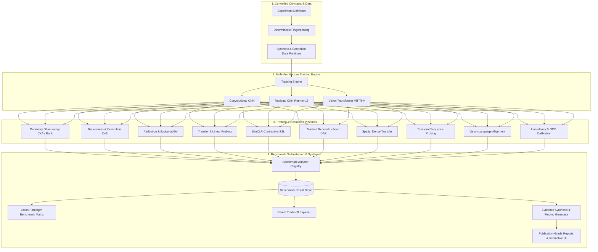

# PRISM Research Platform — Showcase & Technical Presentation Guide

This guide provides a structured, portfolio-ready overview of the **PRISM** research system for technical reviewers, hiring managers, interviewers, and collaborators.

---

## 1. 30-Second Project Overview

> **"PRISM** is a reproducible computer-vision research platform designed to study what deep vision models learn internally rather than only tracking their final classification accuracy. It compares CNNs, ResNets, and Vision Transformers across supervised, contrastive self-supervised (SimCLR), reconstruction, and vision-language objectives. It then analyzes internal representation geometry, transfer dynamics, corruption robustness, feature explainability, spatial/temporal awareness, and probability calibration through a unified, controlled benchmarking engine."

---

## 2. 2-Minute Technical Explanation

Modern computer vision benchmarks often treat deep neural networks as black boxes, optimizing solely for top-1 accuracy on static validation splits. However, models with identical accuracy can learn radically different representation geometries, exhibit distinct failure modes under distribution shift, or fail to transfer to downstream dense spatial or temporal tasks.

PRISM solves this by establishing a **controlled, first-principles research testbed**:

1. **Immutable Experiment Contracts**: Experiments are defined through declarative Pydantic schemas (`ExperimentDefinition`) with deterministic cryptographic fingerprints, preventing silent configuration drift.
2. **First-Principles Implementations**: Model families (CNNs, Residual Networks, Vision Transformers with patch tokenization and multi-head self-attention), objective functions (Cross-Entropy, NT-Xent contrastive loss, Masked Autoencoder reconstruction, dual-encoder cosine contrastive alignment), and numerical metrics are implemented from foundational mathematics.
3. **Representation Probing Engine**: Feature extraction hooks capture layer-by-layer activations across varying data regimes ($1\%$, $5\%$, $10\%$, $25\%$, $50\%$, $100\%$), computing Centered Kernel Alignment (CKA), effective rank, singular value spectra, and representation drift.
4. **Cross-Paradigm Evidence Synthesis**: 10 domain laboratories feed into a top-level **Benchmark Observatory** via standardized report adapters. PRISM automatically computes Pareto frontiers (e.g., Invariance vs. Accuracy), audits factor controls (detecting confounded comparisons), and synthesizes evidence-backed scientific findings with full lineage tracking.

---

## 3. High-Level Architecture Overview



---

## 4. Strongest Research Capabilities

| Research Pillar | What PRISM Measures | Key Scientific Insight |
| :--- | :--- | :--- |
| **Representation Geometry** | Linear CKA, RBF CKA, Effective Rank, SVD Spectra | ViTs exhibit more uniform cross-layer representation similarity than CNNs, which show sharp early-to-late stage transitions. |
| **Robustness & Invariance** | Accuracy Drop, Representation Drift ($\Delta D$), Latent Shift | Contrastive pretraining (SimCLR) preserves representation geometry under noise better than cross-entropy supervised backbones. |
| **Spatial Dense Probing** | Detection mIoU, Segmentation mIoU, Layer Transferability | Mid-level residual blocks yield higher localization transferability than final classification heads. |
| **Multimodal Alignment** | Zero-Shot Top-1/Top-5, Text-to-Image R@1, Modality Gap | Dual-encoder contrastive alignment creates a structured shared metric space, but displays a non-zero modality displacement gap. |
| **Reliability & OOD** | Expected Calibration Error (ECE), Brier Score, OOD AUROC | Temperature-scaled logits significantly reduce ECE without degrading underlying representation separability. |
| **Evidence Synthesis** | Factor Control Auditing, Pareto Optimization, Evidence Gap Analysis | Automatically flags comparisons that vary multiple independent variables simultaneously as descriptive rather than causal. |

---

## 5. Five Compelling Demo Walkthroughs

### 1. Representation Geometry Comparison
* **Action**: In the **Representation Geometry Observatory**, select **ResNet-18** vs. **ViT-Tiny** across all layer depth percentages.
* **Observation**: Notice the block-diagonal structure in CNN CKA heatmaps versus the expansive global representation similarity in Vision Transformer self-attention heads.

### 2. Perturbation & Representation Drift Forensic
* **Action**: In the **Robustness & Distribution Shift Laboratory**, apply **Gaussian Noise** and **Occlusion Patches** to test samples.
* **Observation**: Observe the paired dual-metric display showing both output classification degradation and internal latent representation drift distance ($\Delta D$).

### 3. Contrastive SSL vs. Reconstruction Representation Transfer
* **Action**: In the **Transfer Dynamics Laboratory**, toggle between **SimCLR SSL** and **Masked Image Modeling (Reconstruction)** pretraining under low data budgets ($1\%$, $5\%$).
* **Observation**: Compare linear probe accuracy slopes; contrastive SSL models achieve higher linear probe separability with fewer labeled examples.

### 4. Spatio-Temporal Video Representation Dynamics
* **Action**: In the **Temporal Representations Laboratory**, inspect temporal pooling vs. recurrent embedding trajectories across frame sequences.
* **Observation**: Examine directional trajectory coherence vectors under temporal frame shuffling perturbations.

### 5. Benchmark Synthesis & Pareto Frontier Exploration
* **Action**: In the **Benchmark Observatory**, select the **Pareto Explorer** tab and plot **Linear Probe Accuracy** against **Expected Calibration Error (ECE)**.
* **Observation**: Identify non-dominated model checkpoints on the Pareto frontier and trace evidence citations directly back to their source evaluation trials.

---

## 6. Example Research Questions Answered by PRISM

1. **RQ1 (Pretraining & Sample Efficiency)**: *How does self-supervised contrastive pretraining compare against supervised pretraining when downstream labeled data is restricted to $\le 5\%$?*
2. **RQ2 (Inductive Bias vs. Global Attention)**: *Do convolutional networks maintain higher spatial localization transferability than Vision Transformers under low-resolution conditions?*
3. **RQ3 (Calibration under Shift)**: *Does higher in-distribution accuracy guarantee better out-of-distribution detection reliability?* (Finding: Not necessarily; uncalibrated high-capacity models often produce overconfident misclassifications on shifted distributions).

---

## 7. Key Engineering & Design Decisions

1. **Zero External Heavyweight Frameworks for Core Math**: CKA, effective rank, attribution gradients, and calibration metrics are implemented using NumPy and PyTorch primitives rather than opaque third-party plugins.
2. **Decoupled Architecture with Adapter Pattern**: Domain laboratories are completely modular; they interface with the Benchmark engine exclusively through immutable `BenchmarkAdapter` contracts.
3. **Deterministic Reproducibility by Design**: Python hash randomization is eliminated from identity signatures; all experiment identities, campaign digests, and seed offsets are computed using cryptographic SHA-256 digests.
4. **Honest Scientific Presentation**: Synthetic benchmarks are explicitly badged as `Controlled Synthetic`; unobserved cells are rendered as missing evidence rather than filled with artificial zeros.

---

## 8. Scientific Limitations & Scope

* **Controlled Synthetic Scale**: Default demonstration datasets are synthesized for fast, deterministic, CPU-compatible execution within standard CI/CD environments.
* **Hardware Footprint**: Full-scale multi-gigabyte foundation model pretraining (e.g. LAION-400M, ImageNet-22k) requires external cluster compute.

---

## 9. How to Run the Platform

```bash
# 1. Setup environment
make setup

# 2. Run deterministic demo generation & report synthesis
make demo

# 3. Launch interactive Research Observatory
make dev
```
Open **`http://localhost:3000`** in your browser.

---

## 10. How to Discuss PRISM in an Interview

* **When asked about Machine Learning Engineering**: Focus on the end-to-end experiment lifecycle, modular software architecture, Pydantic type contracts, deterministic caching, and the 657-test quality gate suite.
* **When asked about Computer Vision & Deep Learning**: Focus on representation geometry (CKA), transformer self-attention mechanisms, contrastive learning dynamics (NT-Xent loss, temperature scaling), spatial dense prediction transfer, and uncertainty calibration.
* **When asked about Systems & Reproducibility**: Highlight the elimination of hidden RNG state, deterministic SHA-256 fingerprinting, zero-dependency data generation, and clean-clone verification.
